# Oefeningen les 6: Basis CSS - oefeningen gevorderden

-----

## Oefening 1: Schilderwerken Vanderbeken.

Open de map oefening01.       
In alle html bestanden ligt reeds de link naar main.css. Deze bevat een import naar reset.css (meer info over een reset stylesheet vind je op https://meyerweb.com/eric/tools/css/reset/ ).             
Vul de css aan aan de hand van de informatie die je als commentaar in **main.css** vindt. De html mag niet gewijzigd worden.
   
index.html enkel met reset.css:     
            
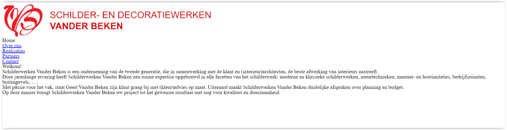    

Eindresultaat:     
index.html            
       

over_ons.html            
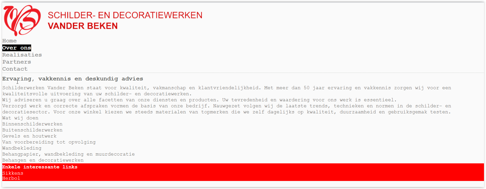       

realisaties.html            
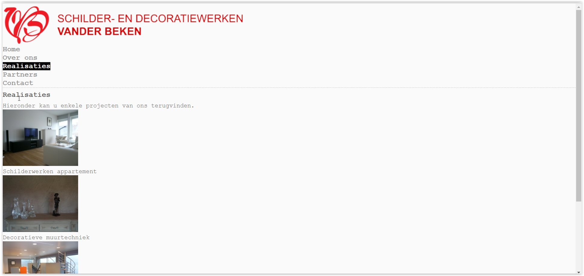       

partners.html            
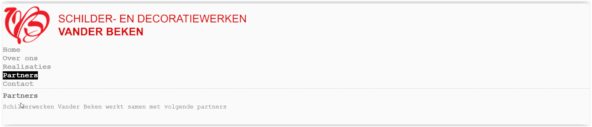       

contact.html            
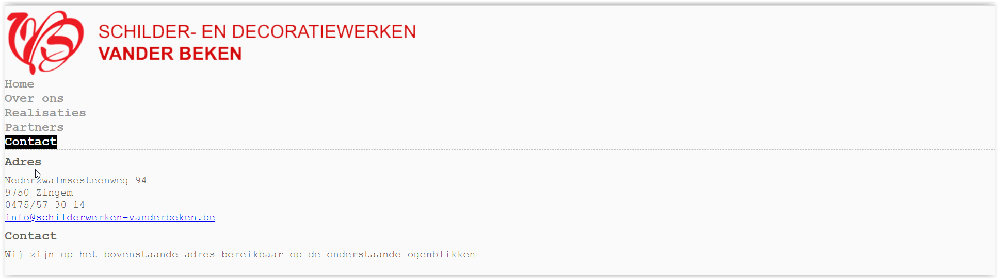       

-----

## Oefening 2: Lekkerrrrrrrr.

Open de map oefening02. 
Maak een map *css* aan en ook een *main.css* in deze map. Leg de link naar dit bestand in *index.html*.

Zonder css         

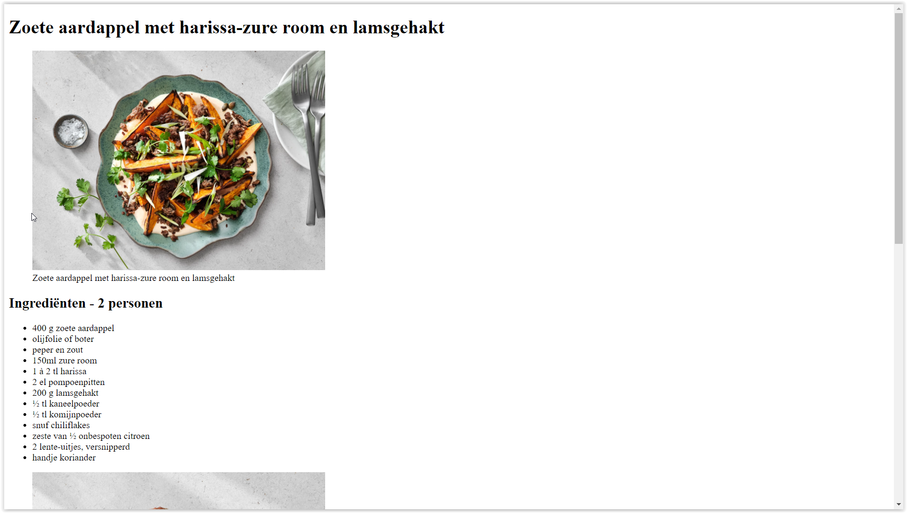          
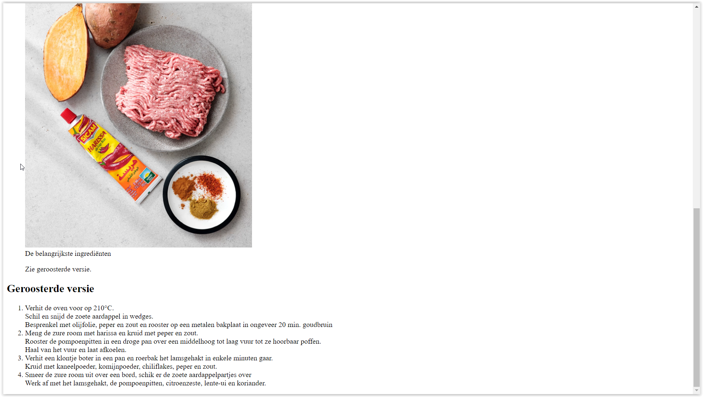

Dit is het eindresultaat met de gepaste/juiste stijlregels.      

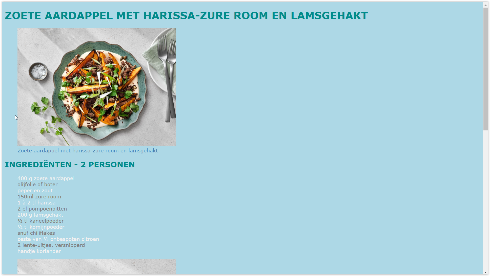          
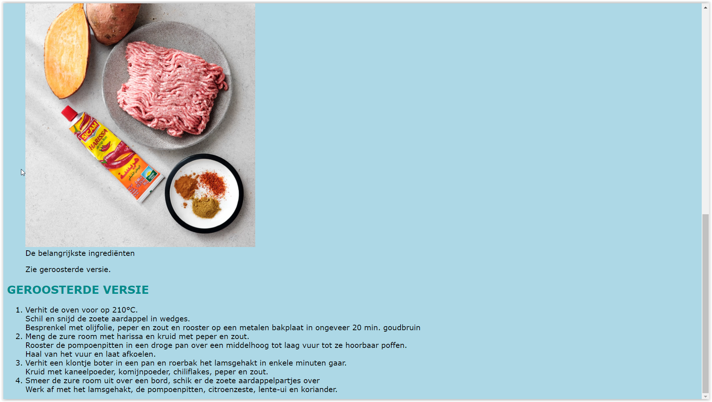          

Lettertypes voor de pagina: *Verdana, Geneva, Tahoma, sans-serif;*    

Volgende kleuren worden gebruikt:      
    - lightblue               
    - darkcyan             
    - steelblue     
    - #f1f1f1;                
    - gray              

Merk op:                  
    - alle headings in hoofdletter staan (niet aanpassen in index.html). Google welke stijlregel je daarvoor moet toepassen.             
    - de lijsttekens van de ongeordende lijst worden niet weergegeven. Ook hier, zoek uit welke stijlregel hiervoor kan gebruikt worden.        

        

-----

## Oefening 3: Kleuren.

Open de map oefening03.           
Maak een map *css* aan en ook een *main.css* in deze map.      
Leg in de *index.html* de link naar deze externe stylesheet.          
Bepaal de juiste selector en stijlregel.    
Tip voor de juiste stijlregel: https://developer.mozilla.org/en-US/docs/Web/CSS/Reference#Keyword_index      

Lettertypes voor de pagina: *Calibri, Verdana, sans-serif;*       
Lettertypes voor alle headings: *Arial, Helvetica, sans-serif;*               

Pagina zonder css.
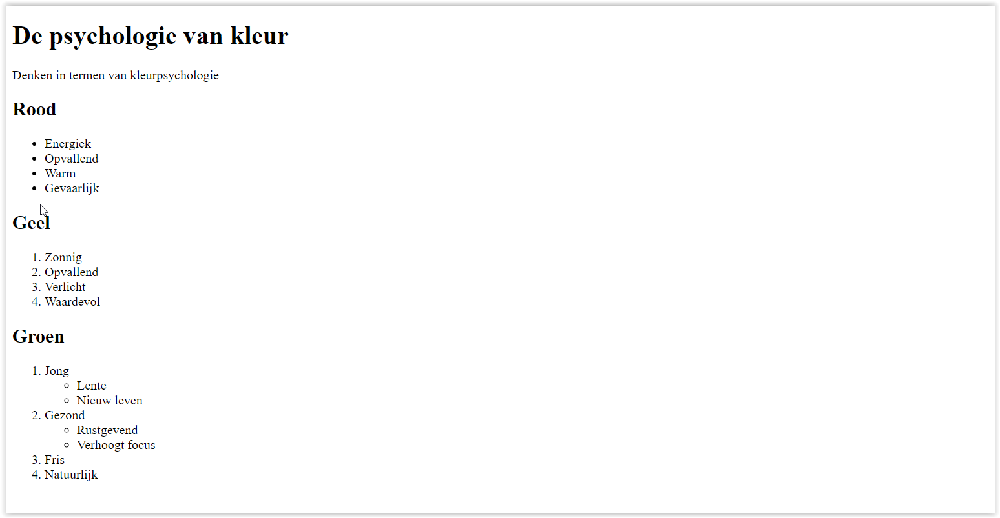          

Eindresultaat.
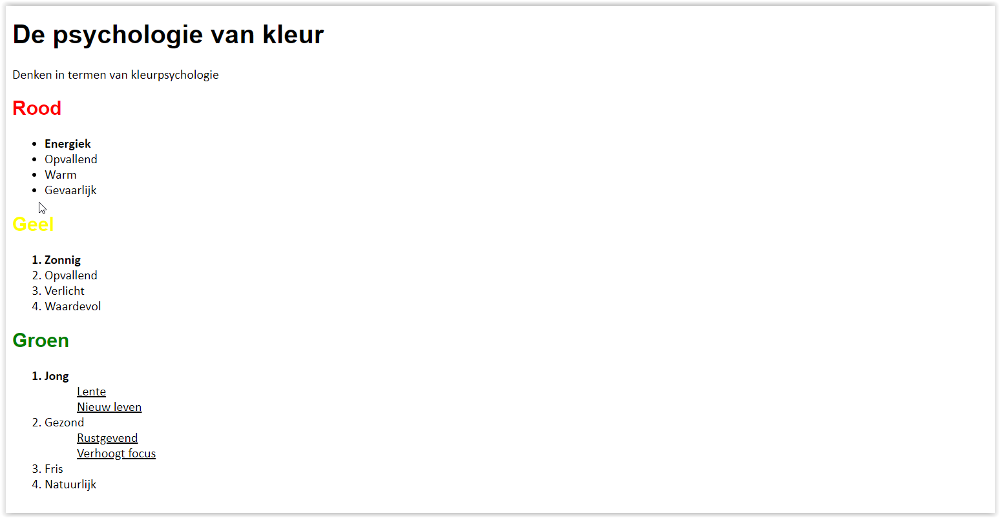          
        

-----
## Oefening 4: Likwiepedia.

Open de map oefening04.
 
Vul de stijlregels aan in *style.css* voor de opmaak van de tabellen zoals hieronder te zien is.
Je mag geen gebruik maken van het class attribuut.              

Volgende kleuren worden gebruikt:      
    - gold               
    - silver             
    - peru     
    - lightpink                
    - lightsteelblue             
    - palegreen              

Eindresultaat.      
            

